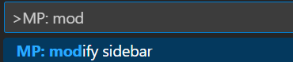
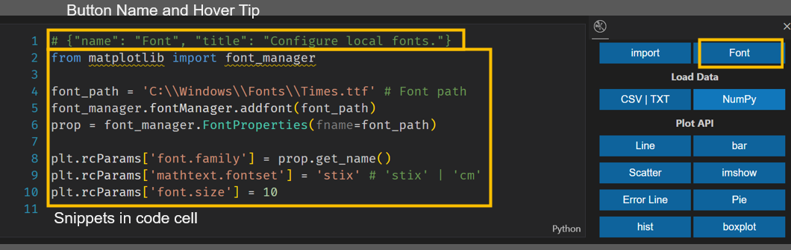
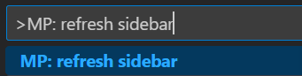

# Matplotlib Pilot

[](https://marketplace.visualstudio.com/items?itemName=litchi.matplotlib-pilot)
[](https://marketplace.visualstudio.com/items?itemName=litchi.matplotlib-pilot)
[](https://marketplace.visualstudio.com/items?itemName=litchi.matplotlib-pilot)
[](https://marketplace.visualstudio.com/items?itemName=litchi.matplotlib-pilot)

Matplotlib Pilot is a VS Code Extension that provides [Matplotlib](https://matplotlib.org) code snippets. It aims to smooth the learning curve of [Matplotlib](https://matplotlib.org) and lower the threshold for its use.

**It is highly recommended to configure this plugin on the right side of the main view (just drag the icon to the right side of the page) to avoid repeated switching of the sidebar.**


If you have any questions, you can send an email to **litchi.code@foxmail.com** or leave a comment in the plugin review section.


## Features

1. Commonly used plotting APIs of Matplotlib are provided in the sidebar. Clicking on them will insert the corresponding code snippet at the cursor position in the editor.
2. Users can conveniently modify the sidebar, including editing code snippets and adding or deleting buttons.
3. The "color picker" in the sidebar can freely select a suitable color. After the selection is completed, the color string will be automatically copied.
4. The `Concepts` button can view locally attributes such as "color", "marker", "linestyle", and "cmap" in Matplotlib.
5. The `Template` button can open the template browser, which provides some frequently used plotting template "notebook" files. It will be continuously upgraded in the future.
6. The `Custom Temp` button can manage user-defined "notebook" template files after configuration, and it is not limited to "Matplotlib" scripts.


## Dependency

Matplotlib is a Python package for data visualization. Make sure it is installed before use.
```sh
pip install matplotlib
```

It is recommended to use this plugin in `.ipynb` files. After creating a file with the suffix `.ipynb` in VS Code, the `Jupyter` plugin will be automatically recommended. Depending on the network situation, manual installation may be required.`ipykernel`
```sh
pip install ipykernel
```

At the same time, make sure that the version of VS Code is higher than `1.72.0`.


## Setting

* The command `MP: refresh sidebar` can refresh the sidebar from the default notebook file.
* The command `MP: modify sidebar` calls out the notebook file corresponding to the default side panel view. After the user directly modifies this file and saves it, call the `MP: refresh sidebar` command. When the plugin is reloaded, the modified sidebar view can be used.


### Modify the sidebar view and its code snippets
Users can customize the sidebar code snippet buttons. For example, modify the content of the code snippet corresponding to the font modification button to match the current local environment. Another example is that if you don't like the default drawing style, then you can create a new button and fill in the code you need.

1. Press `F1` to bring up the command panel in `VS Code` and enter `MP: modify sidebar`.


2. Click the corresponding button to open the notebook file used to configure the sidebar (the `Jupyter` plugin needs to be installed).

3. Now you can modify the corresponding code snippet as needed. After modification, save the file (`Ctrl+S`) and close it.



4. Press `F1` to bring up the command panel in `VS Code` and enter `MP: refresh sidebar`. Click the corresponding button.


5. Restart `VS Code` to see the modified sidebar.


### Custom templates

This plugin provides the function of customizing drawing task templates. Users can create their commonly used drawing scripts into notebook files (with the suffix `.ipynb`). Then, through the following process, they can call out the template browsing interface through the "Custom Template" button and use the corresponding templates to create new tasks. In fact, this is not limited to `Matplotlib` task scripts. Users can also add other commonly used scripts of their own, such as data filtering, fitting, and so on.

1. First, users need to prepare their own `.ipynb` files and corresponding cover images. It is recommended that the aspect ratio of the cover image be approximately 1:1, and the image size is recommended to be controlled below 100 kB. Then write an `html` file as follows. You can copy the following content. Then only need to modify the content in `<div class="container">`. The main parameter meanings are as follows:
+ The content in `h2`: The title of several scripts in this group. It is recommended to add scripts with similar functions to the same group.
+ The `src` content in the `img` element: The relative path pointing to the cover image, relative to the path of the html file.
+ The `id` value: It is recommended to give a unique number, which can be `group name` + `number or meaning`.
+ The value of `data-ipynbpath`: The absolute path of the drawing script.
+ The characters of the `button` element: The text that will be displayed on the button. It is recommended to be a functional description of the script. Try to keep the number of words as short as possible and not exceed 12 Chinese characters.


```html
<!DOCTYPE html>
<html lang="en">

<head>
    <meta charset="UTF-8">
    <meta name="viewport" content="width=device-width, initial-scale=1.0">
    <title>Custom Templates</title>
</head>

<body>
    <div class="container">
        <h2>Group One</h2>
        <div class="box">
            
            <button id="a" data-ipynbpath="D:\path_to\a.ipynb">item-a</button>
        </div>
        <div class="box">
            
            <button id="b" data-ipynbpath="D:\path_to\b.ipynb">item-b</button>
        </div>
        <h2>Group Two</h2>
        <div class="box">
            
            <button id="c" data-ipynbpath="D:\path_to\c.ipynb">item-c</button>
        </div>
        <div class="box">
            
            <button id="d" data-ipynbpath="D:\path_to\d.ipynb">item-d</button>
        </div>
    </div>
</body>

</html>
```

2. After completion, press the `F1` key in VS Code to bring up the command panel. Then enter `define custom template` and the corresponding command will be displayed. After clicking, a file selection dialog box will be called up. Selecting the `html` file written above will enter the template `HTML` production. Depending on the number of templates, the waiting time will also be different. Usually, it will be completed instantly. During the production process, it will not detect whether the `notebook` file exists, but it will read the cover file. If the reading fails, the default cover will be used as a substitute and a pop-up prompt will be displayed in `VS Code`.

3. After the template is made, use the shortcut key `Ctrl +,` in VS Code to bring up the settings interface. Select Extensions in the left directory and locate `Matplotlib Pilot`. Fill in the path of the template `HTML` made above in the item `Custom Template HTML`, for example:
```txt
D:\path\to\customTemplate.html
```


## TODO

+ Improve template function.
+ Improve code and functional testing.

