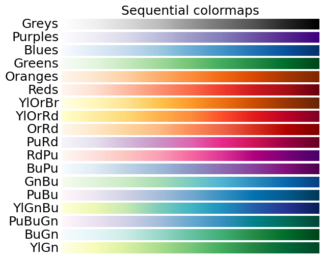
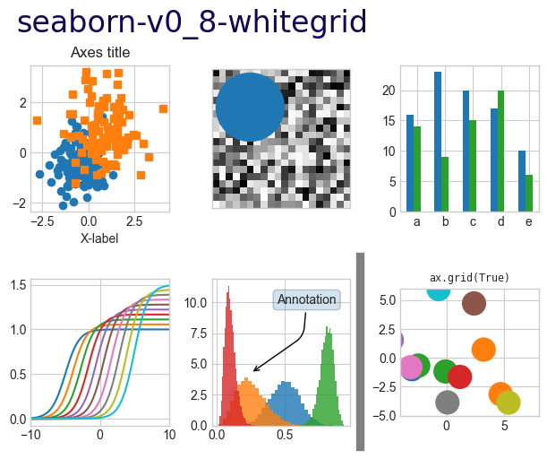

## [matplotlib.markers](https://matplotlib.org/stable/api/markers_api.html)

The marker can be set by `marker="marker name"` within the drawing function. The marker size is set by `markersize1=<16>`.

Here are some commonly used `marker names`.

|marker|symbol|description|
|-|-|-|
|"."||point|
|","||pixel|
|"o"||circle|
|"v"||triangle_down|
|"^"||triangle_up|
|"<"||triangle_left|
|">"||triangle_right|
|"1"||tri_down|
|"2"||tri_up|
|"3"||tri_left|
|"4"||tri_right|
|"8"||octagon|
|"s"||square|
|"p"||pentagon|
|"P"||plus(filled)|
|"*"||star|
|"h"||hexagon1|
|"H"||hexagon2|
|"+"||plus|
|"x"||x|
|"X"||x(filled)|
|"D"||diamond|
|"d"||thin_diamond|
|"\|"||vline|
|"_"||hline|

## [matplotlib.colors](https://matplotlib.org/stable/gallery/color/named_colors.html)

The control parameter for color is `color="color name"`. There are many forms of `color name`, including:
1. Single letter:

2. Word:

3. Six-digit hexadecimal color value.

+ #ff0094
+ #ff0000
+ #000000

## [colormap](https://matplotlib.org/stable/gallery/color/colormap_reference.html)

The control parameter for color mapping is `cmap="colormap name"`. Commonly used `colormap names` are:

+ `jet`: The default option for `ANSYS Fluent`.
+ `coolwarm`: The default option for `Paraview`.
+ `hot`: The default option for `Comsol`.
+ `Greys` or `gray`: Grayscale.
+ `binary`: Black and white binary.
+ All `colormap names` support `colormapname_r` to reverse.

## [linestyles](https://matplotlib.org/stable/gallery/lines_bars_and_markers/linestyles.html)

The line style parameter can be set by `linestyle="linestyle name"`. The line width is controlled by `linewidth=<2>` or `lw=<2>`. Commonly used `linestyle names` are:

+ `solid`: Solid line.
+ `dotted`: Dotted line.
+ `dashed`: Dashed line.
+ `dashdot`: Dash-dot line.

The line style can also be controlled by a tuple `(a, (b, c,...))`, where:

+ `a`: The repetition mode of the line, usually 0.
+ `b`: The length of the line segment.
+ `c`: The length of the blank space.
+ `d`: The length of the next line segment (optional).
+ `e`: The length of the next blank space (optional).

Here are some effects.

## [matplotlib.hatch](https://matplotlib.org/stable/gallery/shapes_and_collections/hatch_style_reference.html)

The `hatch` parameter can be used to specify the fill value of a `patch` object in some plotting functions. This is often used in some [bar charts](https://matplotlib.org/stable/gallery/shapes_and_collections/hatch_demo.html) to distinguish different groups of data.

Here are some possible values for the `hatch` parameter:
1. A single character determines the style.

2. Repeating characters can increase the density.

3. Combining characters can combine styles.

## [matplotlib.style](https://matplotlib.org/stable/gallery/style_sheets/style_sheets_reference.html)

You can use `plt.style.use('bmh')` to set the corresponding style. The style string name can be printed by using `print(plt.style.available)`. After installing some libraries (such as `pip install SciencePlots`), more styles can be used.

Here are some built-in styles.

